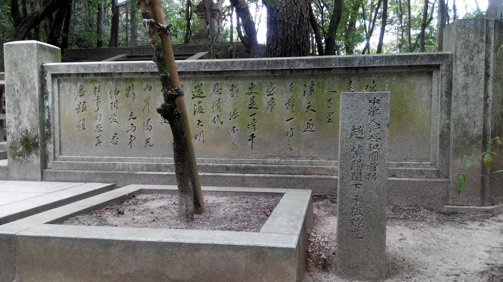

&emsp;&emsp;晚清民国，所谓“数千年未有之大变局”，东学与西学迎面相碰。“中学为体，西学为用”时尚能持守旧道，待帝制推翻，知识界对时局失望，“全面西化”与对“传统”的全面批判转成风尚。及共和国建立，“太史公”、“冲虚真人”之学定于不可更移之一尊，即至“为了救国，反而陷人了‘亡天下’的险境”之顶峰。王夫之《宋论》有言“二汉、唐之亡,皆自亡也。宋亡,则举黄帝、尧、舜以来道法相传之天下而亡之也”，言虽激烈，然试看今日之境况，恐不在宋末元初之下。

&emsp;&emsp;后学不才，空有虚想。早岁立志，欲复此道法天下。然既无家学之渊源，亦无长辈点拨于侧，初入学林，只因钦慕阳明先生平生事业，误一头钻入《传习录》，然未有一定知识之积累，实一头雾水，不知所谓，蹈当年格竹覆辙也，此时尚束发之年。后渐知学问欲有规模，需立其基础。除粗览《四书》外，特专心于梯利《西方哲学史》，此时已知当日西方之学风头远在中学之上。当日所读之书，大抵揭西方文明之长，窃自比较，困惑日积，反不知中华文明有何长处可比。及读钱宾四先生《晚学盲言》（此为笔者初读钱穆夫子），此诚当时心灵上之莫大启迪。余学识浅薄，但仅凭依稀西方史实哲学之了解，亦知宾四先生于西方多有误解之处，此不待言。而就积极之意义言，《晚学盲言》实为余掀中华文化精粹之之一角，立整体之概观，自此而复探往日所读之典籍，略通晓古人之精神所在，知吾国之文化非如激进者所言一概不如人也，自各有其所长，惟今大多湮没而不复为人所识。

&emsp;&emsp;余精神虽振，而义理仍虚悬，知博观不可轻忽。若以今日学科分野论，则余最用力处，为所谓历史与哲学也。“哲学”概括西学则恰当，于中学则多有抵牾削足，“思想”又嫌宽泛，只好暂用“哲学”为目。今人所著哲学史自是入门必经之门径，此不赘言。唯西哲余虽自认体识不浅，然原典只读过休谟、亚氏几人而已（皆汉文译著），多借学者二手文献。中哲情况稍好，然亦只多读先秦诸子原文，注疏惟四书朱注尔，学案则粗读《宋元学案》节篇，未成体系。就史学基础工夫言，初涉目录、版本、训诂之学，不敢言有所掌握。钱穆夫子外，于我影响最著之历史学者，为余英时先生。经先生《回忆录》知，钱穆夫子创新亚书院之时，已立东西文化比较之方法与视野，先生后来学问，即有此重要背景。余知东西史不可偏废，除中国史著作外，亦留心希腊、罗马史、欧洲近代史著作，特关注时代转变之关键节点，即所谓“古代晚期”（Late Antiquity）与“现代早期”（Early Modern）。

&emsp;&emsp;由于哲学知识之背景，于制度史、历史地理、政治史等诸视角方法中，余特注重思想史之路径。思想史涵义其一，即关注思想与现实之纠葛。近代科学兴起，以往浑然一体不分你我之学独立成家，然统而观之，学科间联系仍密切，方法、结论可迁移、转植（此步需万分谨慎），是而学人愈不可固守单疆界，需有一番跨学科的通识。政治学、社会学之方法固史学之近亲，不可不知其大体。惟经济学一门，近代兴起以来声望甚著，乃有极端者，欲以经济之解释取代一切（历史唯物主义）。此论虽已不为今日严肃之学者所取，然经济学之重要，可见一斑。余亦关注经济学之方法、结论，以为足以构成思想和社会解释的线头一簇。

&emsp;&emsp;面对西方现代思想之“挑战”，学术上最要紧的回应，大概厥有两端，一是“史学的重建”，一是“哲学的重建”。所谓“史学的重建”，指的是通过对中国历史细致、中立、准确（理想如此，与现实总有差距）的研究，发掘历史之“真相”，有类于文艺复兴之于古典希腊、罗马。“哲学的重建”则毋宁说是“中国哲学的现代化”。后者远比前者要困难，在时间的次序上，后者也往往凭依前者为基础。试举两例，以说明何谓“史学的重建”。其一，曾经有学者偏向于在明代晚期寻找所谓“资本主义萌芽”的证据。需注意到《三朝北盟会编》卷二九靖康元年正月八日条“緣京師四方客旅買賣多，遂號富庶。人家有錢本，多是停塌解質舟船往來興販，豈肯間著錢買金，在家頓放”。这条信息的要害处，一是证明经济增长之感性认识以为宋人所知；二是今人所谓晚明“资本萌芽”的证据，在宋代的史料中翻寻，亦非鲜见。近数十年西方中世纪史学界的趋势，是倾向于对启蒙时代学者“黑暗时代”的看法做一修正，看到断裂中延续性的一面，实不绝如缕。讨论中国史，或许倒是过分强调了延续性，而鲜能注意到背后的断裂。找到断裂的存在，还原断裂前后的差异，即一“历史的重建”。

&emsp;&emsp;其二，今日学者反思中国政局前途，常标举“法治”（Rule of Law）与“宪政”，此或不错。然亦有学人以为，“西方”是自古已有此概念，惟中国则无。若考西方法律史，可知罗马法时代亦难言“法治”，亦所谓“法制”（Rule by Law）。细究之，则“法治”、“宪政”皆近代之理念。若就“历史的原型”论，“宪政”即对权力之限制，在近来研究的基础上，似难以笼统言中国帝制时代皆整体划一，就“专制”言，亦差距悬殊。若认同一些西方学者之修正，以为中世纪即有“宪政”之基础，未尝不可言宋代“国是”亦同趋此道。总之，在细致的研究、准确的比较前，含糊而概括性的判断，未必可靠，此亦可指笔者之论。

&emsp;&emsp;《史记·刘敬叔孙通列传》太史公言：“千金之裘，非一狐之腋也；台榭之榱，非一木之枝也；三代之际，非一士之智也。”予愿献绵薄之力，日日引领而望同道也。

