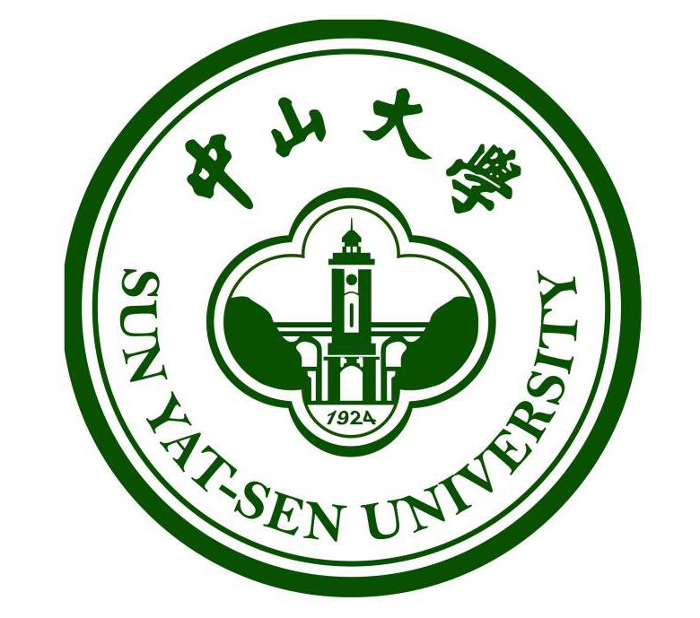

教育經歷
======

&nbsp;  **本科 中山大學 Sun Yat-sen University（2020.9至今）**  
　&emsp;&emsp;&emsp;&emsp; **·**&ensp;院系專業: 計算機學院, 網絡空間安全

本科學業
======

&emsp;&emsp;我选择本科学习计算机科学相关专业的主要原因有二。

&emsp;&emsp;其一是智识上的兴趣，这又可分两方面说，康德哲学有“物自体”的概念，中国古人亦有“道之全体”一说，学科细化的今天，没有物理学家能够掌握所有的物理学分支，人文学科与自然科学的隔阂也从未有现在这么大。不了解近代科学的发展，就不可能理解西方哲学百年来的进路；不对当代科技的基本面貌有一粗略的理性认识，便难以解释周遭的现代社会。计算机技术处在当代技术的交叉口，又是今日大多数技术的基础。

&emsp;&emsp;就我所了解周遭之教育状况言，习文科者难旁及理工，反之则不尽然。另有一层则或近于杞人忧天，基础学科之停滞以为世人所知，投入愈大而收获愈小，已临边际效应。有一所谓“技术奇点”之理论，大意谓过此临界点，则人类之技术将面临一突飞猛进。就现在大多数观察者来看，与“技术奇点”最可能相关的即为人工智能技术（Artificial Intelligence），然已有众多学者怀疑其利未必大过可能之弊，反易置人类于险地。从一位严肃科幻读者的角度来看，掌握一些基本的概念是有好处的。

&emsp;&emsp;第二层的原因，则是一种生存的忧虑。文科从业之艰难以为世人所知，适不愿以道屈人，“作神学之婢女”，学一二技巧，以谋险阻时自保。不过到底，世事难料，两头落空亦未可知，惟进退出处，用舍行藏而矣。

